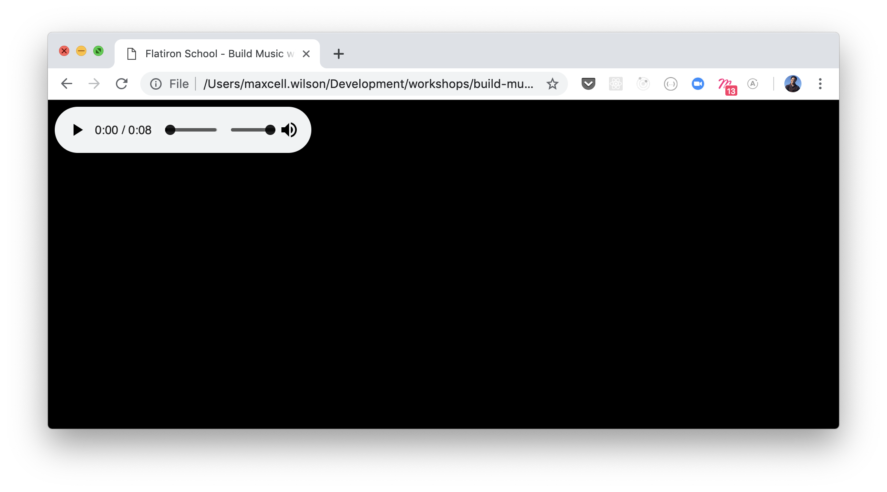
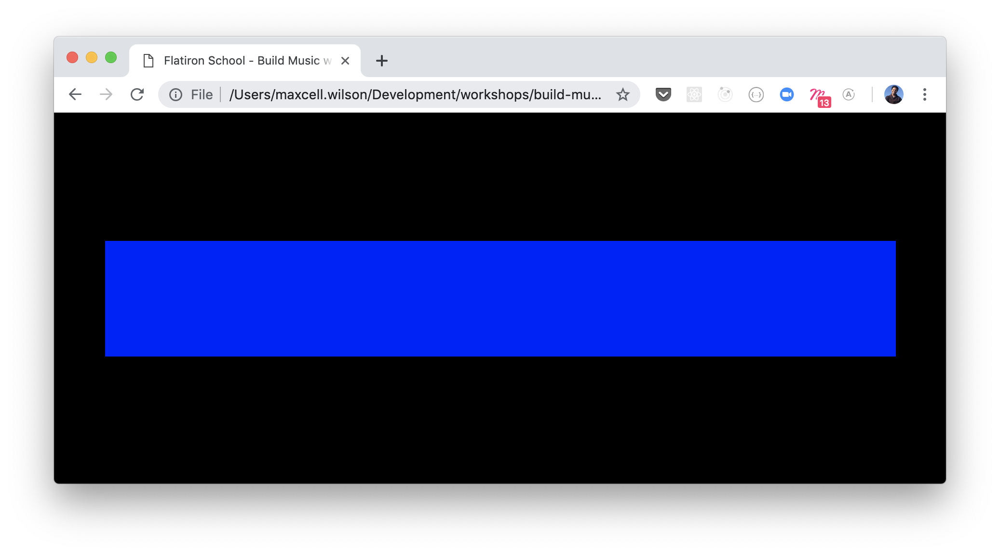
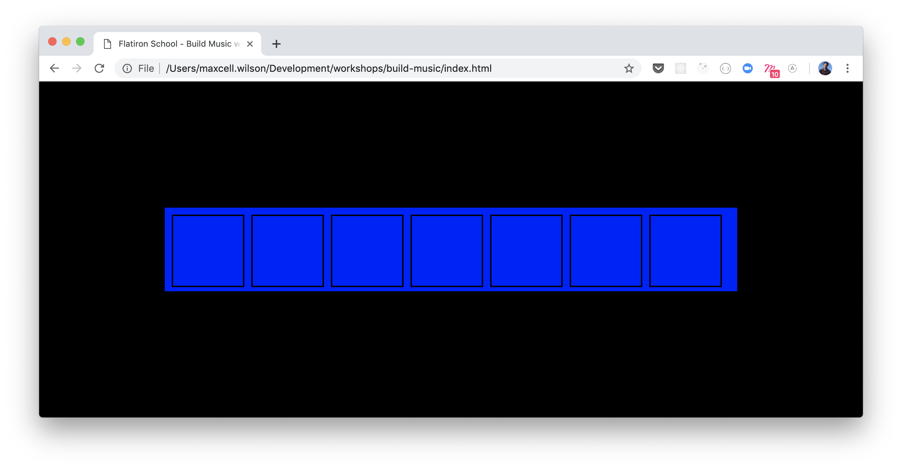
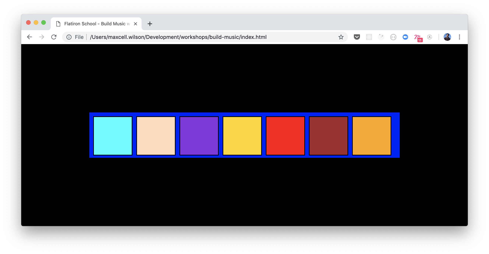

# Build Music with Code Workshop

This is the internal documentation around this workshop. This workshop was initially
given in partnership at the Brooklyn Public Library and still is very new so if you
have any ideas on how to improve it, please feel free to open a Pull Request and
shape it to be something amazing.

### Goal

The typical workshops we give to people are focused around making sure that they
can feel inspired and empowered with the tools to extend their work from the
workshop today. We also have these workshops to ensure that they find a path that
makes them feel as though coding is for them and can be fun. This workshop is focused
around utilizing the tools of the web such as HTML, CSS, and JavaScript. You do
not need to be an expert to give this workshop no do you need to be an expert to
receive this workshop. The goal for both parties is to have fun!

### Top Level Instructions for this Repo

This repository was designed to showcase the journey of the workshop. The first
commit will be found to be the end result, however, an easy way to see step by
step what is happening is to check out the branches. I made sure to put different
phases of the project for a branch and if you want to see the accumulative diff
between branches it may be easier than digging through the commit history. `master`
will represent the finished result if you're interested in seeing it. Each other
branch will be numerically designated from `00`, `01`, `02`... and so forth till
the end.

In this README, you will also see the instructions as they should outline each step
appropriately.

#### 00 Initial

This will be the base of your project. You will want to make sure that this is where
the guests will begin for their work. **BEFORE THE WORKSHOP** of by making sure that
the guests have some way of playing with the code, my strongest suggestion is
to utilize [repl.it](https://repl.it) as a way to ensure every one has the same setup and
they can follow your interactions rather than you utilizing a text editor and waiting
for everyone to catch up. If you wanted something a bit more fancy, you can also
utilize [glitch.com](https://glitch.com) which is a bit easier of a user interface for most.

To start the workshop, you will want to just make sure to break the ice a bit with
folk and talk about who you are and what your role is at Flatiron School. It is good
to make a connection with your guests, but not so much is it required. Speaking can
be intimidating and just treat it like a set of students in your cohort and have
fun with everything.

From there, talking briefly about the structuring of the project directory:

- The `index.html` file is going to be the file that connects the entire project together
and is how we will be able to interact with our project.
- The `style.css` file is going to tell us how the project is going to look like. Telling
us that this where it gets its directions for how to be presented on the page.
- The `script.js` file lets us be able to manipulate the page so when we click it will
play sounds.
- The `media` folder is going to contain a bunch of sounds for us that our `index.html`
will actually need in order to know what it should play whenever we click a box.
They will not need to do anything in this folder but everything else is fair game.

**Reader Note**: You will see a folder called `assets/` inside of here, this is only for
the instructor so they can see images/GIFs/etc. in the README file.

##### End Result

I always recommend showing them the end result in some way. These are the ways I
have finished, and none of them are "perfect" but if you wanted to use them here
are the links:
- [Flatiron Music @ repl.it](https://repl.it/@maxcell/FlatironSchool-Music)


#### 01 Let's Talk about Audio

Our project is going to be focused on playing sounds in the browser. It is important
to begin our conversation about how it does that. In our `index.html`, we are going
to essentially tell the browser, "Hey, I have this file at *this* location and I'd
like a way to access it please!" We are going to do this with the HTML5 `<audio>` tag.

So to start, you will want to make sure to show off one `<audio>` tag being linked in
the HTML file. Add this inside of the `<body>` tag, preferably at the bottom.

```html
<body>
  <!-- ... -->
  <audio id="cNote" controls>
    <source type='audio/mpeg' src='./media/c_note.mp3'></source>
  </audio>
</body>
```

Here we are adding the link to our first audio file. The `<audio>` tag is going
indicate to the browser we are going to have some connection. You'll notice the
`controls` attribute in there, this just going to be present for this part of the
presentation to showcase the ability to play a note using a player. Tell them that the
`id` is going to help us identify it later when we go to JavaScript.

Unlike most tags, it is going to require a child tag known as `<source>`.
This will tell our program, "Whenever you are asked about audio from this place,
remember this is the source". The `<source>` tag is going to require a `type`
attribute and a `src` attribute.

- `type` tells the program which media type it is supposed to be, in this case this
will be a format for an `mp3` and so we give it `audio/mpeg`.
- `src` tells the program where is it supposed to find the audio to play. This will
be a path to which ever note we want. In our case, we will do this for each note
we want to play.

**Reader Note**: There are several different audio files placed within the project.
The reason they are there are to act as fallbacks IN CASE an audio file doesn't
produce any sound whatsoever. There is a possibility of this and so what you can
do is if a student isn't hearing anything 1) make sure their audio is on, 2) ensure
the path is correct, but if the first two are properly done, then 3) utilize another
file in the media with the same note prefix and see if it makes a difference.

Once we add this line to the page, we can open this up in our browser. It should
begin to look like something like this:



If we press the play button, we will notice it makes a sound! ~~ MAGIC ~~. It happens
to play the musical note known as "C". This is the base note for starting on a piano.
You will want to make sure the students are copying this same step down. It is easy
to fall behind in this syntax. Once you feel everyone is ready, we are going are
going to need to do is add each note's `mp3` into their own `<audio>` and
`<source>` tags. Replicate this step for the other 6 notes in order as the following:
C, D, E, F, G, A, B. Make sure everyone also removes the `controls` attribute after
they make sure the audio is playing correctly for the specific note.


**Brief Music Aside**: This is the C major scale. In music, this is the base for how we can
generate many different sounds/harmonies. For a scale, we have 8 notes but the first and last
are the "same" note just at a different pitch. So technically there is an ending C but it will
be at a higher pitch.


By this point, your HTML should have this at the bottom:

```html
<audio id="cNote">
  <source type='audio/mpeg' src='./media/c_note.mp3'></source>
</audio>
 <audio id="dNote">
  <source type='audio/mpeg' src='./media/d_note.mp3'></source>
</audio>
 <audio id="eNote">
  <source type='audio/mpeg' src='./media/e_note.mp3'></source>
</audio>
 <audio id="fNote">
  <source type='audio/mpeg' src='./media/f_note.mp3'></source>
</audio>
 <audio id="gNote">
  <source type='audio/mpeg' src='./media/g_note.mp3'></source>
</audio>
 <audio id="aNote">
  <source type='audio/mpeg' src='./media/a_note.mp3'></source>
</audio>
 <audio id="bNote">
  <source type='audio/mpeg' src='./media/b_note.mp3'></source>
</audio>
```

You will once again want to make sure every one is following along and has
spelled things properly. It is easy to make small typos at this step and just
check in with them.

#### 02 Drawing some boxes

Once you've completed the audio files and look at the `index.html` in the
browser again, you'll notice it is pretty empty. So let's actually add our
keyboard. This is the part where you can dive a bit into what is HTML, why
do we use it, and how are we gonna use it here.

Start off by talking about tags and how they are special meaning to the
browser in how it should display. You can show off a `p` tag or a `h1` tag and
how they are presented differently in the browser due to styles.

Then go into the piece we will do which is adding a `<div>` that will
be our "instrument" so they have a visual presentation of the board.

```html
<body>

  <div id="instrument">
  </div>
  <!-- audio tags below -->
</body>
```

You can remind them that this `id` attribute tells our browser that this element
is special and can be referred to by the name "instrument". If they go into the
browser they will see this:



This is just solely going to act as the stage for us and it is also easier to talk
about how CSS works, if you wanted to take an aside, this could be fine. Tell them
that in the `style.css`, this tells us how it should look on the page. You will
want to be sure to highlight that styles are a set of rules with a given "property"
we want to change and the "value" we want to give it.

If they want to experiment, tell them to change the background color for our
`#instrument` from `blue` to `red`. They may ask about why is there a `#` in front of
the word and you can tell them it is because it is an id and this is how CSS knows to
identify it. HTML doesn't need to make sure it has it, but CSS can only find it with
it.

Now the next step is putting squares for each of the notes. The `#instrument` is
the place we want to put each of our `box` divs. So now update the code to look as
such:

```html
<body>

  <div id="instrument">
    <div class="box" id="c"></div>
    <div class="box" id="d"></div>
    <div class="box" id="e"></div>
    <div class="box" id="f"></div>
    <div class="box" id="g"></div>
    <div class="box" id="a"></div>
    <div class="box" id="b"></div>
  </div>
  <!-- audio tags below -->
</body>
```

If they open the browser again, you can see there are these border boxes that
exist in our blue space. These will represent different keys we want to press.
The reason it is able to do this is because of the `div` inside have another attribute
called `class`. This is where you can talk about the differences between `class`
and `id`. `class` is meant to be reusable styles across the page where an `id` is
meant to be uniquely identifiable. We want to make sure each div has an `id` to
match the music note it will present.



Here the guests can practice some of their own CSS. We will want to make sure that
we give each of our notes their own background color. You can show them how to
add a background color to a specific id and then let them choose their colors or
just come up with a random set of colors that you enjoy, here are the ones originally
used:

```
#c { background-color: aqua; }
#d { background-color: peachpuff; }
#e { background-color: blueviolet; }
#f { background-color: gold; }
#g { background-color: red; }
#a { background-color: brown; }
#b { background-color: orange; }
```



**Reader Note**: Make sure to check in with everyone that they  have colors working.
If you notice any disengagement, just try to help them out with any typos. Typically,
people make typos 1) in the HTML file because they didn't add the id properly,
2) CSS because they are referencing the id improperly or 3) because they misspelled
the property/value.

### 03 Making those Boxes play Sound!

Now we're almost at the end of the journey. We have gotten our audio clips attached
to the HTML, we have our boxes ready and waiting. This is now where we will want to
add some JavaScript to make the interactivity happen. This is the hardest part in
the entire presentation for the guests. Tell them to not worry too much because this
is something they can learn a bit more about during our program!

Before starting this section, make sure that you have your script tag linked properly
in your HTML. **It isn't there by default!**

```html
<!-- Inside of the index.html -->
<script src="script.js"></script>
```

From there, we want to grab 2 things from the DOM
1. The audio tag with its id
2. The box that we want to click to play that audio

So inside of now the `script.js`, we want to do it one step at a time for the guests
and so let's make it work with the C note first and then let them work on making it
happen for the others.

```js
var cNote = document.getElementById('cNote'); // grabs the audio
```

You will want to explain a bit about JavaScript to make this part not seem like
too much of a mystery. Starting on the right side of the equal sign, we are
talking to our `document`, aka the HTML page and grabbing some content by an
id (the same one we called back in the HTML). We find it on the page and then
say we want to store it into a place we can call by name (in this case the name is
cNote).

The second part of getting the box I actually end up doing it "inline" without
saving it to the variable. I once again like to give them a bit of context absolute
how it all works together. We are going to once again find a place on the page
(the box) and tell it to listen for an event (click) and tell it to do some "action",
which in JavaScript we call a callback. In this callback, we will want to make sure
to start at the beginning of our file each time and then hit play.

```js
var cNote = document.getElementById('cNote'); // grabs the audio

// This is grabbing the box
document.getElementById('c').addEventListener('click', () => {
  // Callback

  // Tell my audio note to start at 0
  cNote.currentTime = 0
  // Then play
  cNote.play()
})
```

**IMPORTANT**: If you don't tell the note you've selected to start at 0, it will
never rewind back to the beginning of the file. It is super important to have
that step then make sure to play.

From there, we just recreate this step for each of the notes and boxes, so we
should see this 7 times for each note.

This is the basics of the presentation! If you want to do extra stuff, you can
consider adding `hover` effects to the boxes or try making it work with your actual
keyboard to play each note. They are not required but stuff that will be outlined

### Questions
If there are any questions, feel free to contact me, Prince Wilson about it through
email or on Slack.
